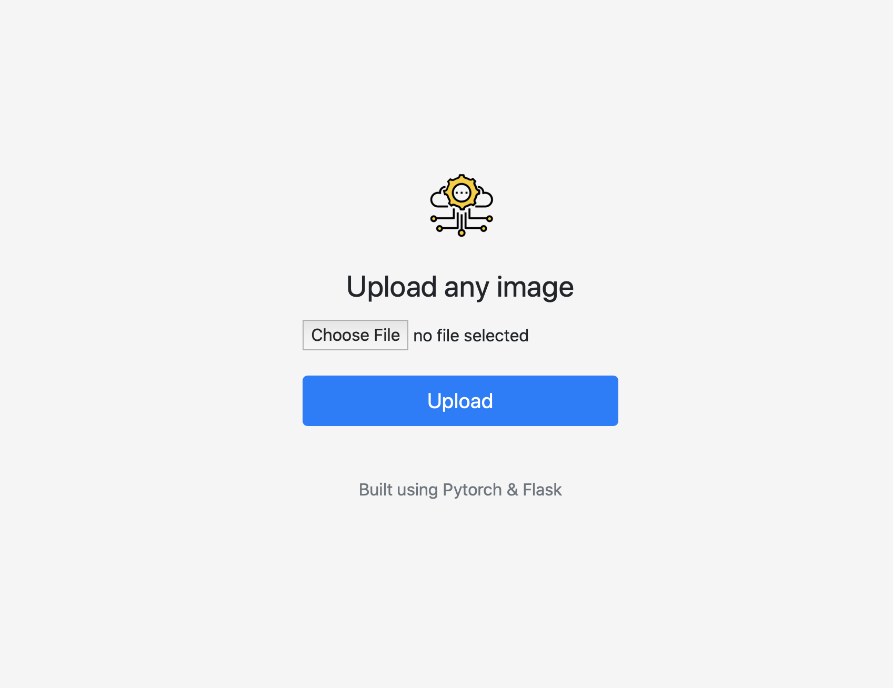

# Object detection - Deep learning project use case.

# Overview

## Scope of Work

The main scope of this project is perform Object detection use case and  cover end to end deep learning life cycle. The theme that is covered is  called  **"Know the objects at home"🏠** which basically  app that can capture and identify different objects in your home from the uploaded image that can assist to create Home Inventory.  

## High level Components

- HighProvide the Deep learning life cycle and Best Practices
- Framework and Model Selection
- Data Collection, Preparation & New Data labeling
- Implementation
    - Model Training , Testing and Create Model for Deployment
    - Infrastructure for Model Serving
    - Web/Mobile App Development
- Observations/Lesson Learnt
- Future Work

    Continous Integration and Model Train, Re train and Deployment pipeline

    Monitoring, Drift Detection, Retraining

    Mobile/Web App Development

## High level Architecture & Components Involved


## Approach to Implementation(Technology and Design Choices)

### Model Framework

- Pytorch
- Tensorflow

Final selection 

- Pytorch (based on FSDL 2021 learnings 🙂)  

### Model Selection

Different models are available for Object detection and Classification

Faster R-CNN, R-FCN, SSD, FPN, RetinaNet , YOLOv3, YOLOv5

It is very hard to select the best model from different object detectors. Their is no straight answer to it and  we make choices to balance accuracy and speed as main criteria but also other criteria that complement this selection . I opted for YOLO family of object detectors as its faster and provide better accuracy.

In addition, I have opted YOLOv5 on this as the implementation of YOLOv5 is done in PyTorch.This makes it easier to understand, train and deploy the model

The YOLOv5 includes five different size models: YOLOv5s (smallest), YOLOv5m, YOLOv5l, YOLOv5x (largest). The inference speed and mean average precision (mAP) of these models are shown in the following figure:


     Final selection

      - YOLO V5 and for Proof of Concept used YOLOv5s

### Dataset Selection

      As my use case is to detect the objects at home, most closest and widely available public data set is COCO([https://paperswithcode.com/dataset/coco](https://paperswithcode.com/dataset/coco))

      This data set  consists of 328K images and covers with 80 thing categories (such as person, bicycle, elephant) and a subset of 91 stuff categories(grass, sky, road),

     More importantly we have YOLOv5 already pre trained on COCO dataset. this helps in significant time to train the model.

   Final selection

       - COCO dataset + Custom Object training

       - Pre selected class + Custom Classes

### Technology Selection

        - Infrastructure  and Model Serving

           Proof of Concept

                App Development 

                     - Flask

                Deployment 

                    - Docker

 -  Model Training

     Proof of Concept

                Training , Validation and Testing

                    -  Google Co lab 

                Logging & Experiment tracking

                    -  Weights & Bias 

                 Data Labeling  

                     -  [https://www.makesense.ai](https://www.makesense.ai/)   to label new custom datasets

## Implementation Steps

### 1.Training the YOLOv5  and Adding the  Custom Object

 COCO128 data set have 80  classes .If you are adding new class, you can create new images (in makesense.ai) and update the dataset. How ever  to train additional classes while retaining the existing classes we need  label the new data and the existing data of COCO classes with all instances of all classes (old + new), and then train the combined (old + new) dataset together.

 You can follow the below link to train the YOLOV5 leveraging the COCO 128 dataset and add  custom object to that list.  

   [https://github.com/ultralytics/yolov5/wiki/Train-Custom-Data](https://github.com/ultralytics/yolov5/wiki/Train-Custom-Data)

```
 number of classes
nc: 81

# class names
names: ['person', 'bicycle', 'car', 'motorcycle', 'airplane', 'bus', 'train', 'truck', 'boat', 'traffic light',
        'fire hydrant', 'stop sign', 'parking meter', 'bench', 'bird', 'cat', 'dog', 'horse', 'sheep', 'cow',
        'elephant', 'bear', 'zebra', 'giraffe', 'backpack', 'umbrella', 'handbag', 'tie', 'suitcase', 'frisbee',
        'skis', 'snowboard', 'sports ball', 'kite', 'baseball bat', 'baseball glove', 'skateboard', 'surfboard',
        'tennis racket', 'bottle', 'wine glass', 'cup', 'fork', 'knife', 'spoon', 'bowl', 'banana', 'apple',
        'sandwich', 'orange', 'broccoli', 'carrot', 'hot dog', 'pizza', 'donut', 'cake', 'chair', 'couch',
        'potted plant', 'bed', 'dining table', 'toilet', 'tv', 'laptop', 'mouse', 'remote', 'keyboard',
        'cell phone', 'microwave', 'oven', 'toaster', 'sink', 'refrigerator', 'book', 'clock', 'vase', 'scissors',
        'teddy bear', 'hair drier', 'toothbrush','washingmachine']

```


### **Train (based on** [https://github.com/ultralytics/yolov5/wiki/Train-Custom-Data](https://github.com/ultralytics/yolov5/wiki/Train-Custom-Data))

Train a YOLOv5s model on COCO128 by specifying dataset, batch-size, image size and either pretrained `--weights yolov5s.pt` (recommended), or randomly initialized `--weights '' --cfg yolov5s.yaml` (not recommended). Pretrained weights are auto-downloaded from the [latest YOLOv5 release](https://github.com/ultralytics/yolov5/releases).

```
# Train YOLOv5s on COCO128 for 5 epochs
$ python train.py --img 640 --batch 16 --epochs 5 --data coco128.yaml --weights yolov5s.pt
```

All training results are saved to `runs/train/` with incrementing run directories, i.e. `runs/train/exp2`, `runs/train/exp3`etc. 

During training you log the results to Weights and Biases ( [https://wandb.ai](https://wandb.ai/),) and you can create Detailed Reports of your results using the W&B Reports tool.


Caution: 

You need large set of data labeled for the custom. objects(washing machine in above example) to match and distribute the exisiting coco data set size. Matching COCO128 dataset is ok. but if need more accuracy then we need even large data set collection and labelling

Significant training time required as you are retraining for both exisiting and  new classes.

### 2.Create the Flask Web App, build as Docker image for Serving

**# Yolov5 object detection model deployment using flask**

This repo contains example apps for exposing the [yolo5](https://github.com/ultralytics/yolov5) object detection model from [pytorch hub](https://pytorch.org/hub/ultralytics_yolov5/) via a [flask](https://flask.palletsprojects.com/en/1.1.x/) api/app.

**## Web app**

Simple app consisting of a form where you can upload an image, and see the inference result of the model in the browser. Run:

```python
$ python3 app.py --port 5000
```

then visit http://localhost:5000/ in your browser:




**## Rest API**

Simple rest API exposing the model for consumption by another service. Run:

```python
`$ python3 restapi.py --port 5000`
```

Then use [curl](https://curl.se/) to perform a request:

```python
`$ curl -X POST -F image=@tests/hall.jpeg 'http://localhost:5000/v1/object-detection/yolov5s'`
```

```python
The model inference results are returned:
"[{\"xmin\":103.1018295288,
   \"ymin\":34.3509750366,
   \"xmax\":303.906036377,
   \"ymax\":201.2188720703,
   \"confidence\":0.8780525327,
   \"class\":62,
   \"name\":\"tv\"},
  {\"xmin\":345.2606811523,
   \"ymin\":328.0134887695,
   \"xmax\":413.1716308594,
   \"ymax\":397.1974182129,
   \"confidence\":0.5606856942,
   \"class\":58,
   \"name\":\"potted plant\"},
  {\"xmin\":454.2457275391,
    \"ymin\":110.6774673462,
    \"xmax\":497.1942138672,
    \"ymax\":149.4735565186,
    \"confidence\":0.5559735298,
    \"class\":74,\"name\":\"clock\"},
  {\"xmin\":110.2718200684,
   \"ymin\":260.0922241211,
   \"xmax\":138.9441375732,
   \"ymax\":302.4708862305,
   \"confidence\":0.4961591661,
   \"class\":75,\"name\":\"vase\"}]
```

**## Run & Develop locally**

Run locally and dev:

```python
`python3 -m venv venv`
`source venv/bin/activate`
`(venv) $ pip install -r https://raw.githubusercontent.com/ultralytics/yolov5/master/requirements.txt`
`(venv) $ pip install -r requirements.txt`
`(venv) $ python3 app.py --port 5000`
```

**## docker**

# Build

```python
docker build -t objectdetection_flask_yolo5:latest .
```

# Run

```python
docker run -p 5000:5000 objectdetection_flask_yolo5:latest
```

## Findings and Learnings

I started this project as Novice user to Deep learning and CNN and below are few learnings 

- Under estimation the complexity of Object detector selection for the  use case.  Most of the time went in selecting right framework and the right object detection model, their is also Cognitive services available from Public cloud vendors that can do object detection . To make things worse technology is evolving so rapidly and their are too many opinions and options to choose from. 

- We still don't have  data set that can cover all objects to cover the home inventory use case. COCO dataset which is  widely popular one covers only 80 Objects, out of which the objects that are for home inventory use case is even less. This means significant new data labeling and data sets ,custom objects training required 

- We still don't have measurement of items that are not detected in the images. Our performance/accuracy measurement is always based on what is manually labelled in a image  vs what is incorrectly labeled but I can't find how we measure the items that are missed

- Significant training time and resources to train the custom objects.

- Models can get bigger to deploy after Dockerise the whole application, Infrastructure Pipeline should consider this. For example currently AWS Lambda can support docker  images unto 10Gb

- Based on my proof of concept and study , We are not ready yet for object detection for generic use case like this to completely automate the generation of house objects inventory yet . Object detection cannot replace manual classification, So use case need to be updated to consider object detection to supplement the manual classification.  

Example: As part of this use case to capture home inventory,  this model support in automatic population of the objects and user have option to edit /update this classification. When model accuracy improves and new data classes are getting added then number of manual classification reduces.

- Under estimation of effort involved to make it work end to end.

## Next Steps  (way to go..)

- Apply the learnings from this Proof of Concept
- More Data sets and Data Labeling
- Mobile App development
- Development , and Model Training, Deployment and Re-training Pipeline
- Monitoring and Drift Detection.

## Reference

[https://github.com/ultralytics/yolov5](https://github.com/ultralytics/yolov5)

[https://github.com/yankai364/Object-Detection-Flask-API](https://github.com/yankai364/Object-Detection-Flask-API)

[https://github.com/rafaelpadilla/Object-Detection-Metrics](https://github.com/rafaelpadilla/Object-Detection-Metrics)

[https://github.com/robmarkcole/yolov5-flask](https://github.com/robmarkcole/yolov5-flask)

[https://jonathan-hui.medium.com/object-detection-speed-and-accuracy-comparison-faster-r-cnn-r-fcn-ssd-and-yolo-5425656ae359](https://jonathan-hui.medium.com/object-detection-speed-and-accuracy-comparison-faster-r-cnn-r-fcn-ssd-and-yolo-5425656ae359)
[https://www.programmersought.com/article/64016693954/](https://www.programmersought.com/article/64016693954/)
